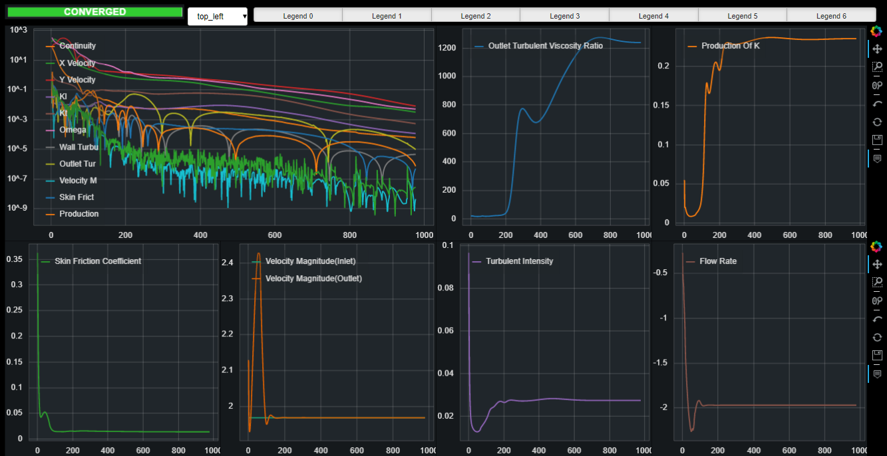

# Fluent Monitors

Runs a [Bokeh](https://bokeh.pydata.org/en/latest/) served app of monitors for ANSYS Fluent, useful when running without a GUI, or if you want a little more useful monitoring platform. This was written for use on Windows, ~~hopefully it will be migrated to a linux platform in the future.~~

There are likely quite a few bugs as this was written quickly to allow me to monitor solutions while away from home, but as of now, it's *mostly* working.

I don't expect to support this much in the future besides a few bug fixes here and there, as the plan is to move this to a universal CFD (or other data) monitoring application based in Javascript. Link to the repository coming soon!

**Features:**

- Live zoom & pan

- Mouse cursor data tip

- Hide-able plots (Interactive Legend)

- Reconfigurable plot layout through `monitors.ini` file

- Accessable from host ip address anywhere on your network

**Basic Usage:**

- Create a `monitors.ini` file in your current working directory. If you run the app without one, it should create one for you and open it for editing

- The `monitors.ini` file is well annotated, follow the instructions there

- Start the monitors with `bokeh serve monitors` from the root folder, or using the batch script
  
  **Note:** Fluent must be running for the monitors to connect, ~~right now~~ this only supports one instance of Fluent.
